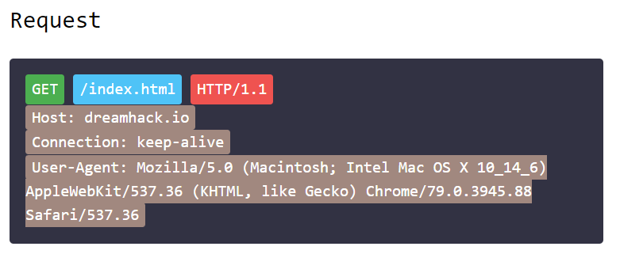
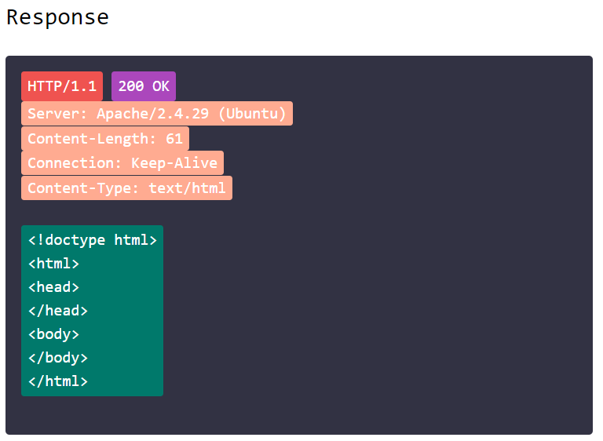
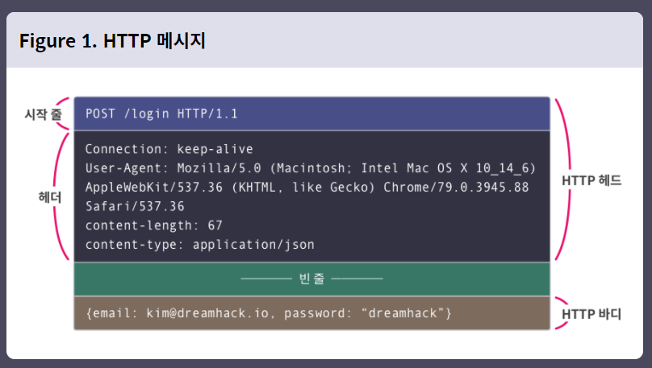
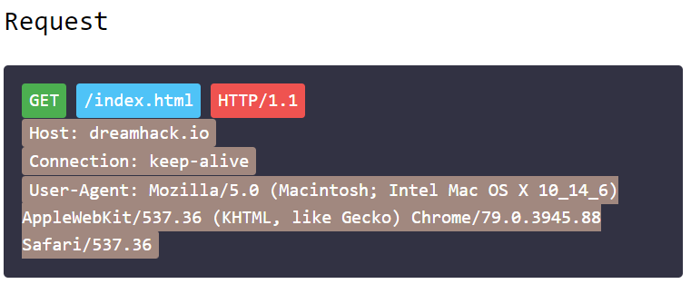
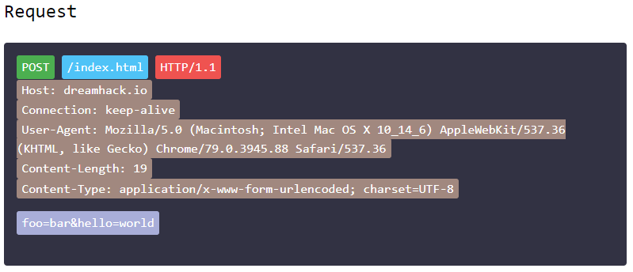

# security
## Web Hacking

---
### 1. Backround: HTTP/HTTPS
#### 1. 인코딩

- 컴퓨터의 모든 데이터는 0과 1로 구성됩니다. 지금 보고 있는 글도 사실은 0과 1의 집합입니다. “사과”가 사과를 가리키는 데 약속이 필요하듯, 0과 1로 우리의 문자를 표현하는 것도 일종의 약속 덕분입니다. 이런 약속들을 특별히 **인코딩(Encoding) 표준**이라고 부르는데, 대표적으로 **아스키(Ascii)**와 **유니코드(Unicode)**가 있습니다.

- 아스키는 7비트 데이터에 대한 인코딩 표준입니다. 이를 이용하면 알파벳과 특수 문자 등을 표현할 수 있습니다. 예를 들어, 아스키에서 1 한 개, 0 다섯 개, 1 한 개를 이어 붙이면 “A”로 해석됩니다. 이에 따라 “1000001”이라는 데이터를 아스키로 변환하면 “A”가 됩니다.

- 컴퓨터가 개발된 초기에는 각 문자권마다 고유의 인코딩 표준을 사용했습니다. 영어는 아스키, 한글은 CP-949, EUC-KR 등을 사용했습니다. 그런데 이러한 방식은 호환성 측면에서, 국제 소프트웨어를 개발하려는 회사에 큰 부담이 됐습니다. 가끔 소프트웨어를 실행했을 때 글자가 🆡🆡🆡 등으로 출력되는 것이 인코딩이 호환되지 않아 발생하는 문제입니다.

- 이러한 어려움을 해결하고자 유니코드라는 새로운 표준이 만들어졌습니다. “Uni(하나의)”라는 접두사가 나타내듯, 유니코드는 모든 언어의 문자를 하나의 표준에 담겠다는 목표로 제정되었습니다. 유니코드에서 한 문자는 최대 32개의 비트로 표현됩니다. 32비트로 표현할 수 있는 정보의 가짓수는 2^32, 대략 42억 개입니다. 전 세계의 문자를 표현하고도 남을 넓은 공간입니다. 그래서 최근에는 한글, 한자, 히라가나, 가타카나, 알파벳과 같은 문자 외에 각종 이모지(Emoji)들도 유니코드에 포함되고 있습니다.😁

- 인코딩을 이용하면 우리의 문장을 컴퓨터에 저장하고, 표현할 수 있습니다. 그리고 네트워크를 이용하면 인코딩한 정보를 다른 사람들과 쉽게 교환할 수도 있습니다. 드림핵의 컨텐츠도 유니코드로 인코딩된 데이터가 웹 서버를 통해 우리에게 전달되고 있는 것입니다.

---
#### 2. 통신 프로토콜📃
- 웹 서버에 있는 리소스를 클라이언트가 받아 보려면, 클라이언트는 웹에게 특정 리소스를 지정하여 제공해달라고 요청해야 합니다. 그러면 서버가 해당 요청을 이해하고, 대응되는 동작을 통해 클라이언트에게 리소스를 반환합니다. 여기서 클라이언트의 행위를 요청(Request), 서버의 행위를 응답(Response)이라고 합니다

- 요청과 응답은 우리의 일상에서도 빈번히 일어나는 상호작용입니다. 집에서, 가게에서, 회사에서 누군가에게 뭔가를 달라고 할 때는 항상 요청과 응답이 이뤄집니다. 눈여겨볼 점은 이러한 행위가 어느 정도 약속되어 있다는 것입니다. A에게 B를 요구할 때, “A야 B 좀 줘”라고 이야기하면, A가 B를 찾아서 건네줍니다. 상황에 따라 요청의 뉘앙스가 조금 바뀔 수는 있지만, 대개는 비슷합니다.

- 프로토콜(Protocol)은 위와 같이 규격화된 상호작용에 적용되는 약속을 이릅니다. 일상생활의 상호작용은 대부분 관습 또는 에티켓이라는 형태의 느슨한 프로토콜을 따릅니다. 통화할 때는 보통 “여보세요”로 시작해서 본론을 말하고 “끊어”, “바이” 등으로 통화를 끝맺습니다. 그런데 때에 따라서는 본론을 말하기 전에 서로 신원을 밝히거나, 아예 인사를 생략할 수 있습니다. 맥락을 아는 사람만 이해할 수 있는 애매한 표현을 사용할 수도 있습니다. 이처럼 일상에서 사람과 사람이 통신할 때는 관습을 따르되 약간의 융통성을 발휘해도 정보를 교환하는 데 큰 문제가 발생하지 않습니다.

- 반면, 컴퓨터와 통신할 때는 비교적 엄격한 프로토콜을 사용해야 합니다. 왜냐하면, 컴퓨터가 해석의 융통성을 발휘하게 하는 것은 매우 어렵고, 이 과정에서 오히려 통신 오류가 발생할 가능성을 높일 수 있기 때문입니다. 그래서 많은 컴퓨터 통신 프로토콜은 각 통신 주체가 교환하는 데이터(이하 메시지)를 명확히 해석할 수 있도록 문법(syntax)을 포함합니다. 일반적으로 이 문법에 어긋나는 메시지는 잘못 전송된 것으로 취급하여 무시됩니다. 예를 들어, 웹 서버에 “GET A”라고 보낼 것을 “GIVEME A”라고 보내면, “GET”과 “GIVEME”의 의미가 비슷하므로 A를 반환할 만하지만, 웹서버에서는 이를 오류로 처리합니다.

- 현재까지 제정된 표준 통신 프로토콜에는 **네트워크 통신의 기초가 되는 TCP/IP**, **웹 애플리케이션이 사용하는 HTTP**, **파일을 주고받을 때 사용하는 FTP** 등 매우 많은 종류가 있습니다. 이번 코스에서는 그중 HTTP에 대해 배워보겠습니다.

---
#### 3. HTTP
- HTTP(Hyper Text Transfer Protocol)란 **서버와 클라이언트의 데이터 교환**을 **요청(Request)과 응답(Response) 형식으로 정의한 프로토콜**입니다. 팀 버너스 리(Team Berners-Lee)와 그의 팀이 제정한 이후, 현대 웹 서비스의 바탕이 되는 프로토콜로 자리 잡았습니다.

- HTTP의 기본 메커니즘은 클라이언트가 서버에게 요청하면, 서버가 응답하는 것입니다. 웹 서버는 HTTP 서버를 HTTP 서비스 포트에 대기시킵니다. 이 포트는 일반적으로 TCP/80 또는 TCP/8080입니다. 클라이언트가 서비스 포트에 HTTP 요청을 전송하면, 이를 해석하여 적절한 응답을 반환합니다.

</img> 
</img> 

- 💡네트워크 포트와 서비스 포트

    **네트워크 포트(Network Port)** 란 네트워크에서 서버와 클라이언트가 정보를 교환하는 추상화된 장소를 의미합니다. 포트에는 항구라는 의미가 있는데, 클라이언트가 서버의 포트에 접근하여 데이터를 내려놓고, 서버가 클라이언트에 보낼 데이터를 실어서 돌려보내는 장면을 연상하면 포트의 기능을 이해할 수 있습니다. 편의상, 네트워크를 설명하는 맥락에서는 네트워크를 생략하여 “포트”라고 부르기도 합니다.
     

    **서비스 포트(Service Port)** 는 네트워크 포트 중에서 **특정 서비스가 점유하고 있는 포트**를 이릅니다. 예를 들어, **HTTP가 80번** 포트를 점유하고 있다면 HTTP의 서비스 포트는 80번 포트가 됩니다.
     

    포트로 데이터를 교환하는 방식은 전송 계층(Transport Layer)의 프로토콜을 따릅니다. 대표적으로는 TCP와 UDP가 있습니다. TCP로 데이터를 전송하려는 서비스에 UDP 클라이언트가 접근하면, 데이터가 교환되지 않습니다. 반대의 경우도 마찬가지입니다. 그래서 서비스 포트를 표기할 때는 서비스가 사용하는 전송 계층 프로토콜을 같이 표기하기도 합니다. 예를 들어, HTTP의 서비스 포트가 TCP/80 이라고 하면, HTTP 서비스를 80번 포트에서 TCP로 제공하고 있다는 뜻입니다.
     

    포트의 개수는 운영체제에서 정의하기 나름입니다. 그러나 현대의 윈도우나 리눅스, 맥 운영체제는 0번 부터 65535번까지, 총 65536개의 같은 수의 네트워크 포트를 사용합니다.
     

    **포트 중 0번부터 1023번 포트는 잘 알려진 포트(Well-known port) 또는 특권 포트(Privileged port)** 라고 합니다. 문자 그대로 각 포트 번호에 유명한 서비스가 등록되어 있습니다. 대표적으로 **22번 포트에는 SSH**, **80에는 HTTP**, **443에는 HTTPS**가 할당되어 있습니다. 잘 알려진 포트에 서비스를 실행하려면 관리자 권한이 필요합니다. 따라서 클라이언트는 이 대역에서 실행 중인 서비스들은 관리자의 것이라고 신뢰할 수 있습니다.

---
#### 4. HTTP 메시지
- HTTP 메시지에는 **클라이언트가 전송하는 HTTP 요청**, 그리고 **서버가 반환하는 HTTP 응답**이 있습니다. 기능과 세부 구조에서는 차이가 있지만, 크게 보면 이들은 HTTP 헤드와 바디로 구성된다는 공통점이 있습니다.

</img> 

##### 4-1. HTTP 헤드
- HTTP 헤드의 각 줄은 CRLF로 구분되며, 첫 줄은 시작 줄(Start-line), 나머지 줄은 헤더(Header)라고 부릅니다. 헤드의 끝은 CRLF 한 줄로 나타냅니다.

- 시작 줄의 역할은 요청과 응답에서 큰 차이가 있습니다. 그러므로 이에 대해서는 조금 뒤에 각각을 자세히 기술하면서 설명하겠습니다.

- 헤더는 필드와 값으로 구성되며 HTTP 메시지 또는 바디의 속성을 나타냅니다. 하나의 HTTP 메시지에는 0개 이상의 헤더가 있을 수 있습니다.

※ CRLF
CR : Carriage Return (\r) 
LF : Line Feed (\n) 

##### 4-2. HTTP 바디
- HTTP 바디는 헤드의 끝을 나타내는 CRLF 뒤, 모든 줄을 말합니다. **클라이언트나 서버에게 전송하려는 데이터가 바디에 담깁**니다.

---
#### 5. HTTP 요청
- HTTP 요청은 **서버에게 특정 동작을 요구**하는 메시지입니다. 서버는 해당 동작이 실현 가능한지, 클라이언트가 그러한 동작을 요청할 권한이 있는지 등을 검토하고, 적절할 때만 이를 처리합니다.

</img> 
</img> 

##### 5-1. 시작 줄
- HTTP 요청의 시작 줄은 **메소드(Method)**, **요청 URI(Request-URI)**, 그리고 **HTTP 버전**으로 구성됩니다. 각각은 띄어쓰기로 구분합니다.

- 메소드는 URI가 가리키는 리소스를 대상으로, 서버가 수행하길 바라는 동작을 나타냅니다. HTTP 표준에 정의된 메소드는 8개가 있으나, 여기서는 비교적 자주 사용되는 GET과 POST 메소드만 설명하겠습니다.

- **먼저 GET은 리소스를 가져오라는 메소드**입니다. 이용자가 브라우저에 **웹 서버의 주소를 입력**하거나 **하이퍼링크를 클릭**하면, 새로운 페이지를 렌더링하기 위해 리소스가 필요합니다. 이때 **브라우저는 GET 요청을 서버에 전송하여 리소스를 받아옵**니다. 반대로, **POST는 리소스로 데이터를 보내라는 메소드**입니다. **전송할 데이터는 보통 HTTP 바디에 포함**됩니다. 로그인할 때 입력하는 ID와 비밀번호, 게시판에 작성하는 글 등이 POST로 서버에 보내집니다.

- 이 외에 요청 URI는 메소드의 대상을, HTTP 버전은 클라이언트가 사용하는 HTTP 프로토콜의 버전을 나타냅니다.

##### 5-2. 헤더와 바디
- 시작 줄을 제외한 헤더와 바디는 HTTP 메시지에서 설명한 것과 같습니다.
- 📎HTTP 요청의 메소드 및 URI에 대해 더 자세히 알고 싶다면, 여기에서 표준 문서를 보실 것을 추천합니다.
    https://www.w3.org/Protocols/rfc2616/rfc2616-sec5.html

---
#### 6. HTTP 응답

##### 6-1. 시작 줄

##### 6-2. 헤더와 바디

